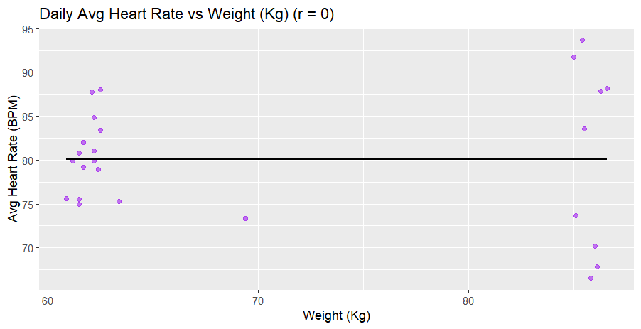
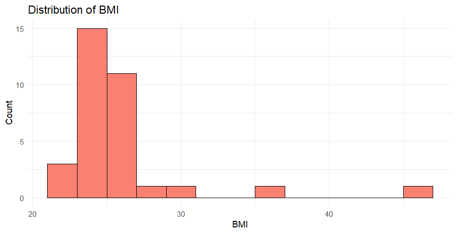
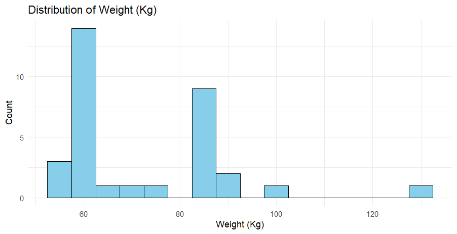
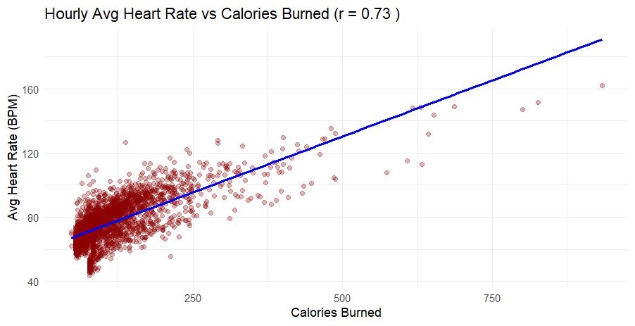
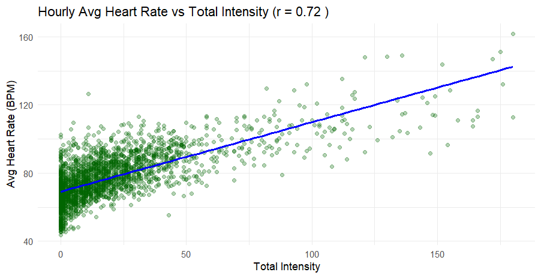
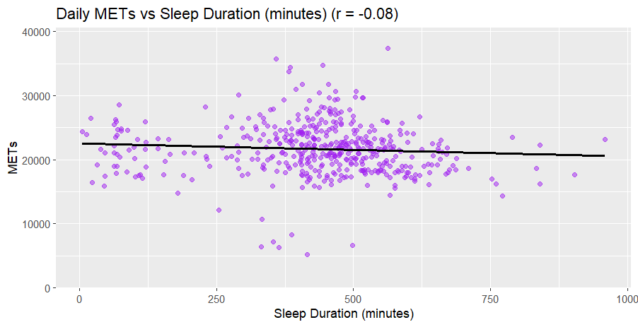
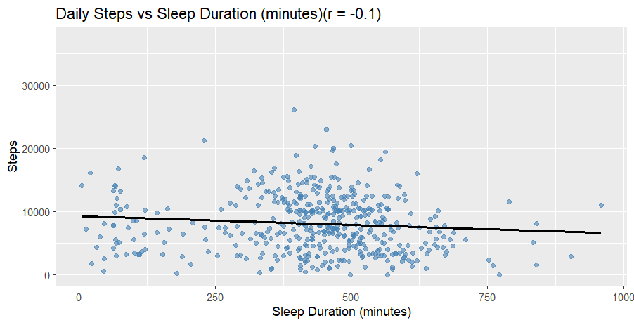
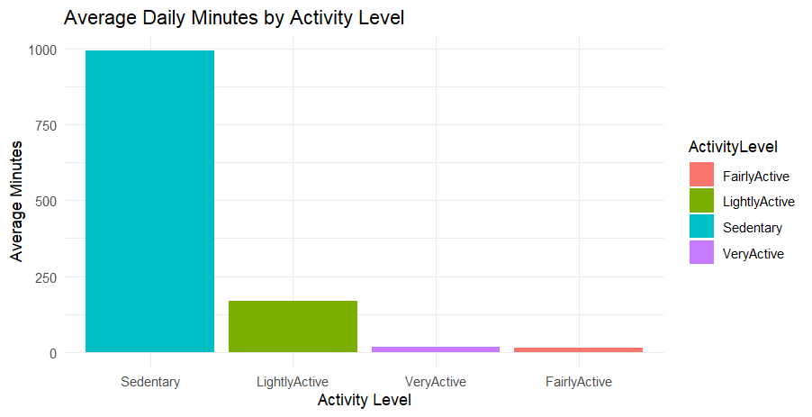
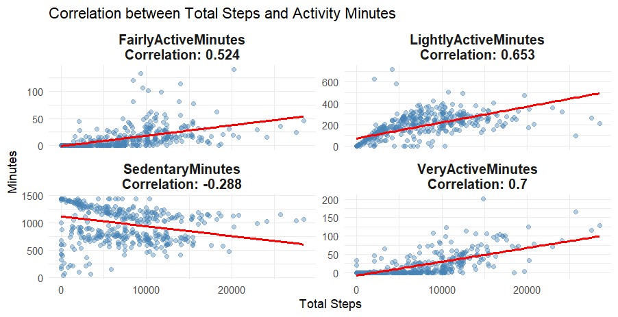

# Introduction

This project analyzes data from Fitbit fitness devices to gain insights for better marketing. Bellabeat is a company that manufactures health-focused smart devices for women. Bellabeat has seen rapid growth since its founding in 2013 and is aiming to strengthen its position in the global smart device market. The company collects data on physical activity, sleep, stress, and reproductive health.

I will analyse and aim to provide recommendations to  better understand user engagement and find new opportunities for growth. For this analysis I will only use R, to keep it simple but insightful. I was also able to conclusively show that **most users use the products for excercises**. 

The dataset used for this project comes from [Kaggle](https://www.kaggle.com/datasets/arashnic/fitbit) and contains usage data collected from 33 Fitbit users over the course of about a month. 

This README is organized into 3 parts:
1. **Data Cleaning** – Overview of data preparation steps  
2. **Data Analysis** – Key findings and patterns
3. **Recommendations** – Better Marketing strategies for Bellabeat

# Data Cleaning

- The dataset was on Kaggle and was already mostly clean and well structured. However, to better analyse the data I decide to put it into 6 different files and run some sanity checks, which are always important. Also, there were a lot of different files and I wanted to organize them more and better understand their structure and columns. 
- I performed this exploration and cleaning process [Data_Cleaning_and_Exploring](Data_Cleaning_And_Exploring.R) file. The main cleaning process I did was removing the `Fat` column and put it in the [weight_Log.csv](Combined_Data/weight_Log.csv), because it had 31/33 NA values.
- To make the datasets easier to analyze, I joined related files:

  - Minute-level datasets (minuteCalories, minuteIntensities, minuteMETs, minuteSteps) were merged into a single [minute_merged](Combined_Data/minute_merged.csv) csv using left_join() on `Id` and `ActivityMinute`. (Note: `minuteSleep` was kept separate because I would not focus on this file.)

  - Hourly-level datasets (hourlyCalories, hourlyIntensities, hourlySteps) were merged into a [hourly_merged](Combined_Data/hourly_merged.csv) csv using the same method on `Id` and `ActivityHour`.
- I also used `summary()` to better understand the structure of the data and explore it further and then put them all in the [Combined_Data](Combined_Data/) folder.

# Data Analysis
- Data Analysis is separated into 5 different parts focusing each R script on 
  1. [Weight Log Analysis](Weight_Log_Analysis.R)
  2. [Hourly Activity Analysis](Hourly_Analysis.R)
  3. [HeartRate Analysis](HeartRate_Analysis.R)
  4. [Minute Activity Analysis](Minute_Analysis.R)
  5. [Daily Activity Analyses](Daily_Activity_Analysis.R)

## Part - 1 : Weight Log Analysis
- I decided to look for correlations between Weight(Kg) and Heart rate on a daily basis. The figure is shown below. There was no correlation found

- Just to better understand the data I also plotted the weight and BMI distribution 

## Part - 2 : Hourly Activity Analysis
- Lastly I looked Average Hourly Intensity Trends which are shown below

- Also I analysed that Mean Daily Steps and Calories Burned are highly correlated. This can be seen in the figure below from their shape. (Note: Just for visibility I have divided steps by 10)

- This suggests that most customers are using BellaBeat products while doing excercises.

## Part - 3 : Heart Rate Analysis
- I also noticed that Total Intensities and Calories are well correlated with Hourly Average Heart Rate as seen in the figures below

- They both have high correlation coefficients of 0.73 and 0.72 respectively. 

## Part - 4 : Minute Activity Analysis
- In this part I first looked at Daily Avg. MET Vs Sleep

- There was little negative correlation, not at all significant.
- I also looked at Daily Avg Steps Vs Sleep

- Again no significant correlation was found. 
## Part - 5 : Daily Activity Analysis
- In this there were 4 different Activity Measures, namely Very Active, Fairly Active, Lightly Active and Sedentary. These are based on how "active" the user was. The Column bar for how the average number of minutes spend in a day is shown below

- I also looked at correlation between Total Steps and Activity Minutes for all 4 categories. The figure for which is shown below

- We can see that there is positive correlation between the 3 different activity levels, the one for which isn't is sedentary. This again proves better into our earlier hypothesis that most users use the products for excercise. It also shows that the correlations are better for more intensive activity levels, which further shows that most users use it for more and more intensive excercises.

# Recommendations 
- Finally I would dedicate this section to give some recommendations for Bellabeat to grow on the international stage. 
  
1. We noticed that although most users spend their time in Sedentary state, they use the products only when they are doing excercises. I would suggest launching a product that helps reduce and burn calories even in their sedentary time. 
2. Also since the products are being used while walking or on a treadmill, Bellabeat can introduce some products that help their users during these excercises. 
3. I would also recommend making some products about better sleep for their users as the users who do more excercies and burn more calories are not correlated to sleeping more, which they should because they need to get more rest. So, to have them recover quickly Bellabeat can introduce a product. 